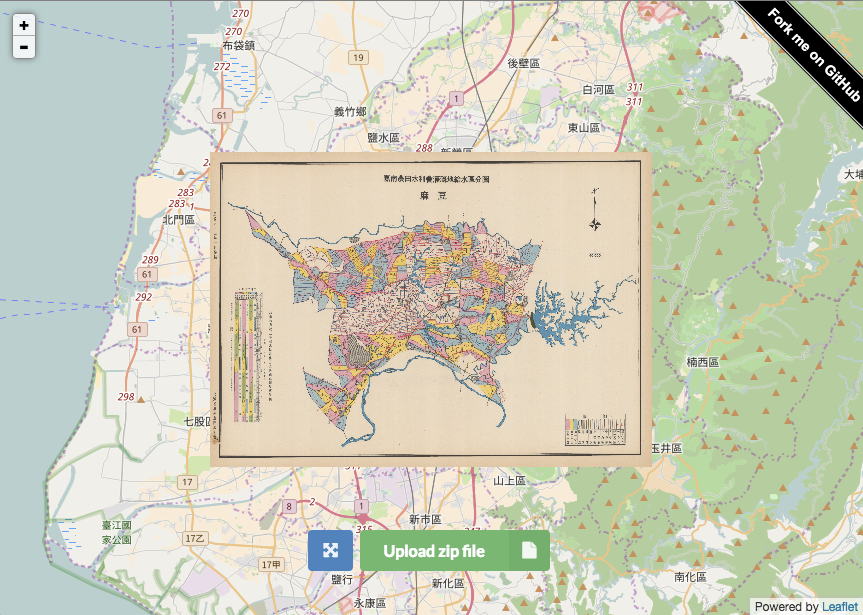

# viewGeoreferencedJpg
View geo-referenced Jpeg on web.
http://gipong.github.io/viewGeoreferencedJpg/

# Usage
For uploading to the website, you need to create a ZIP archive with .jpg, .jgwx(jgw) and .jpg.aux.xml in it.

After finishing the georeferencing process you will get two new files, they have file extension .jgwx and .jpg.aux.xml. These files hold the six coefficients of an affine transformation and projection information for the image. These information can help us to mapping your image to the correct location.

Test Data: [geojpg.zip](demo/geojpg.zip)

# License
MIT

